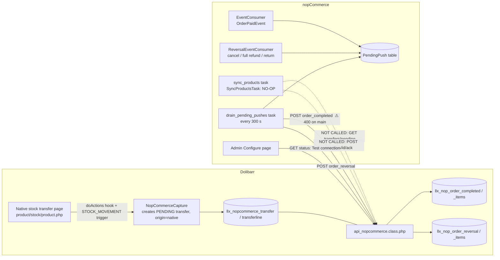

# nopCommerce ⇄ Dolibarr integration: production readiness review

Date: 2026-09-25. Scope: the nopCommerce plugin `Nop.Plugin.Misc.DolibarrIntegration` (repo
`/home/demir/Workspace/nopCommerce`, branch `dolibarr-integration`, HEAD `fe01f2ade7`) and this
Dolibarr module (`htdocs/custom/nopcommerce`, branch `integration-nopcommerce`, HEAD `a862592eb1b`,
identical to `origin/main` for this module). Read-only review: no code was changed.

Paths below are relative to each repo root. `NOP/` means
`/home/demir/Workspace/nopCommerce/src/Plugins/Nop.Plugin.Misc.DolibarrIntegration/`, `MOD/` means
`htdocs/custom/nopcommerce/` in this repo.

---

## 1. Summary verdict

**Not ready for production.** Neither direction of the integration works end to end today.

1. **Dolibarr to nopCommerce (products and stock): not built on the nopCommerce side.** The
   `sync_products` task does nothing on purpose. The code that would create products from
   transfers exists but nothing calls it. The Dolibarr endpoints it would call do exist and work.
2. **nopCommerce to Dolibarr (paid orders): built on both sides, but the two sides disagree on the
   request body.** nopCommerce sends `{"orderid": …, "items": […]}`. The Dolibarr code on `main`
   accepts only a bare JSON array and answers **400** to the object form. So every paid order is
   retried 5 times and then parked as failed. The fix exists on the unmerged branch
   `origin/nopcommerce-order-contract-7` (commit `2e762317f0d`), but it is not on `main`, and
   `main` is the branch that deploys to production.
3. **The link between the two directions is missing.** Even after (1) is built, a product that
   nopCommerce creates from a transfer cannot be matched when it sells. Dolibarr resolves a sold
   line through the product extrafield `nopcommerce_external_id`, and nothing writes that field.

What is solid: the nopCommerce outbound queue (durable table, claim lease, backoff, parking,
requeue, status panel), the Dolibarr stock logic (row locks, one transaction per order,
`orderid` idempotency, reversal caps), the native-transfer capture, and good logging on the
nopCommerce side that never logs the token. The plugin compiles and its 129 unit tests pass.

---

## 2. Architecture as built

Dolibarr never calls the webshop. nopCommerce is always the client (`MOD/class/api_nopcommerce.class.php:34-39`,
`MOD/doc/api.md:3-5`). Auth is the standard `DOLAPIKEY` header (`NOP/DolibarrIntegrationDefaults.cs:53`,
`NOP/Services/DolibarrHttpClient.cs:48`). Every Dolibarr endpoint also needs the right
`nopcommerce->sync` (id 500204) (`MOD/core/modules/modNopCommerce.class.php:169-173`,
`MOD/class/api_nopcommerce.class.php:75`).



Endpoints in the Dolibarr module and their callers on the nopCommerce side:

| Endpoint | Dolibarr code | nopCommerce caller | Called today? |
|---|---|---|---|
| `GET status` | `MOD/class/api_nopcommerce.class.php:73-90` | `DolibarrHttpClient.GetStatusAsync` (`NOP/Services/DolibarrHttpClient.cs:105`), from Test connection (`NOP/Controllers/DolibarrIntegrationController.cs:253-320`) | Yes, only from the button |
| `GET transfers/pending` | `MOD/class/api_nopcommerce.class.php:113-150` | `GetPendingTransfersAsync` (`NOP/Services/DolibarrHttpClient.cs:165`) | **No caller** |
| `GET transfers/{id}` | `MOD/class/api_nopcommerce.class.php:167-182` | `GetTransferAsync` (`NOP/Services/DolibarrHttpClient.cs:190`) | **No caller** |
| `POST transfers/{id}/ack` | `MOD/class/api_nopcommerce.class.php:219-298` | `AckTransferAsync` (`NOP/Services/DolibarrHttpClient.cs:209`) | **No caller** |
| `POST order_completed` | `MOD/class/api_nopcommerce.class.php:340-392` | `NotifyOrderCompletedAsync` (`NOP/Services/DolibarrHttpClient.cs:241`) via `DrainPendingPushesTask` (`NOP/Services/DrainPendingPushesTask.cs:64`) | Yes, but **rejected with 400** (see §5 B1) |
| `POST order_reversal` | `MOD/class/api_nopcommerce.class.php:524-579` | `NotifyOrderReversalAsync` (`NOP/Services/DolibarrHttpClient.cs:306`) via drain (`NOP/Services/DrainPendingPushesTask.cs:115`) | Yes |
| `POST sales` | `MOD/class/api_nopcommerce.class.php:428-481` | none; client models deleted (`/home/demir/Workspace/nopCommerce/docs/dolibarr-sold-stock-sync.md:1-8`) | Dead endpoint |

Scheduled tasks (nopCommerce): `sync_products`, 300 s, installed **disabled**
(`NOP/DolibarrIntegrationDefaults.cs:21-22`, `NOP/DolibarrIntegrationPlugin.cs:74-88`);
`drain_pending_pushes`, 300 s, installed enabled (`NOP/DolibarrIntegrationDefaults.cs:27-28`,
`NOP/DolibarrIntegrationPlugin.cs:90-101`). Dolibarr has no cron jobs (`MOD/core/modules/modNopCommerce.class.php:141`).

---

## 3. Why `sync_products` logged "skipped" (your situation, explained)

### 3.1 Where the message comes from

`NOP/Services/SyncProductsTask.cs:344-348`:

```csharp
public async Task ExecuteAsync()
{
    //without this line an enabled task looks like it ran and found nothing to do
    await _logger.InformationAsync("Dolibarr product sync skipped: the inbound pull flow (Dolibarr to nopCommerce) is not implemented, nothing was pulled");
}
```

That is the whole method. It does not read settings, does not call Dolibarr, and does not call
`SyncProductAsync`. The class says so itself (`NOP/Services/SyncProductsTask.cs:17-22`), and so do
the HTTP client (`NOP/Services/DolibarrHttpClient.cs:154-156`) and the installer
(`NOP/DolibarrIntegrationPlugin.cs:76-78`).

History: the method has returned `Task.CompletedTask` since the first commit of the plugin
(`31e5a1a172`, `8d41abe6d0`). Commit `b6ce3d5863` ("Retire the unreachable inbound half…") made
the task install disabled and marked the pull code as deferred. A later commit (`50011222a5`)
added the log line. So this is not a bug or a misconfiguration: the pull flow was deliberately
never wired up.

The task is installed disabled, so you ran it with **Run now**. nopCommerce runs a disabled task
when forced (`src/Libraries/Nop.Services/ScheduleTasks/ScheduleTaskRunner.cs:117`,
`var enabled = forceRun || (scheduleTask?.Enabled ?? false);`).

### 3.2 What your other observations do and do not prove

- **"Connected. Dolibarr 23.0.3, module 1.0."** This only proves that `GET status` answered 200 with
  a valid key that has the `sync` right (`MOD/class/api_nopcommerce.class.php:75-89`,
  `NOP/Controllers/DolibarrIntegrationController.cs:278-293`). It says nothing about transfers. Also note:
  - The button tests the URL and token **typed in the form**, not the saved settings
    (`NOP/Controllers/DolibarrIntegrationController.cs:272`).
  - "module 1.0" is the hard-coded string on `main` (`MOD/class/api_nopcommerce.class.php:85`). The
    fixed branch reports 1.1, read from the descriptor. So the Dolibarr you reached runs the
    **unfixed** `main` code, including the `order_completed` 400 bug (§5 B1).
  - The status reply also has `pending_transfers` and `webshop_warehouse_id`. The popup does not
    show them, but the nopCommerce log does
    (`NOP/Services/DolibarrHttpClient.cs:138-140`, look for `pendingTransfers=`). That is the
    quickest way to see whether Dolibarr thinks anything is pullable.
- **Size attribute name = "Veličina".** This setting is used **only on the outbound order-paid
  path**, to choose which attribute of a sold line is sent to Dolibarr
  (`NOP/Services/EventConsumer.cs:113-124`; the admin hint says so, `NOP/DolibarrIntegrationPlugin.cs:176`).
  The pull code does not read it. `SyncProductsTask` uses the attribute label that Dolibarr sends
  (`NOP/Services/SyncProductsTask.cs:217`).
- **"One item ready for transfer" on the Dolibarr list.** In the local database this checkout
  points at (`htdocs/conf/conf.php`, DB `dolibarr`), there is exactly one transfer, and it is
  **not** pullable:

  | field | value |
  |---|---|
  | `llx_nopcommerce_transfer.rowid` | 1 |
  | `ref` | `(PROV1)` |
  | `status` | **0 = DRAFT** (`MOD/class/nopcommercetransfer.class.php:98`) |
  | `origin` | `manual` |
  | warehouses | 1 → 3 (3 = `NOPCOMMERCE_WEBSHOP_WAREHOUSE_ID`) |
  | line | product 9 `jeans-black_L`, parent 8 `jeans-black`, qty 50, attribute `Veličina` = `L` |
  | created | 2026-09-10 13:15, before the manual card page was removed |

  `GET transfers/pending` returns only PENDING (1) and FAILED (3) transfers
  (`MOD/class/nopcommercesync.class.php:98-106`). A DRAFT can no longer be validated because the card
  page that did it was removed. The design spec calls these rows "inert"
  (`docs/superpowers/specs/2026-09-12-nopcommerce-native-transfer-capture-design.md:598-604`). The list page still
  shows them with a Draft status and no hint that they will never sync
  (`MOD/transfer_list.php:178-207`). If the instance you looked at is production
  (`erp.csbjeans.com`), check its row: a real transfer made with the native stock-transfer page
  shows `status = 1` and a ref like `NOP-M<id>`.

### 3.3 Root cause, in one sentence

The transfer can never arrive because **(a)** the nopCommerce side has no code that pulls it
(`NOP/Services/SyncProductsTask.cs:344-348`), and, locally, **(b)** the one transfer on the list is a
leftover DRAFT that the pull endpoint would not return anyway (`MOD/class/nopcommercesync.class.php:98-106`).

### 3.4 Intended design of the transfer flow

This is a **pull** design. Source: `MOD/doc/api.md:1-40`, `MOD/class/api_nopcommerce.class.php:92-298`, the capture spec.

1. A user moves stock on Dolibarr's native page `product/stock/product.php`, from
   `NOPCOMMERCE_SOURCE_WAREHOUSE_ID` to `NOPCOMMERCE_WEBSHOP_WAREHOUSE_ID`. The hook
   (`MOD/class/actions_nopcommerce.class.php:87-125`) and the `STOCK_MOVEMENT` trigger
   (`MOD/core/triggers/interface_95_modNopCommerce_NopCommerceCapture.class.php:66-108`) create a
   PENDING transfer, `origin=native`, ref `NOP-M<movement id>`
   (`MOD/class/nopcommercecapture.class.php:173-231`). The stock has already moved at this point.
2. nopCommerce calls `GET transfers/pending?limit=&warehouse_id=&include_failed=`. Each transfer gets
   a fresh `pull_token` (`MOD/class/api_nopcommerce.class.php:136`). Each line carries the variant
   child product, its parent, its `attributes[]` (label and ref of the attribute and of the value,
   `MOD/class/nopcommercesync.class.php:288-320`), price, weight in kg, and qty.
3. nopCommerce creates or updates the product, the `Veličina` attribute mapping, the value, and the
   attribute combination with stock. This is `SyncProductAsync` (`NOP/Services/SyncProductsTask.cs:359-402`).
4. nopCommerce calls `POST transfers/{id}/ack` with the `pull_token`, `success`, and per line
   `nop_product_id` / `nop_combination_id`. On success Dolibarr marks the transfer SYNCED. It moves
   stock only for `origin=manual` transfers (`MOD/class/nopcommercesync.class.php:1015-1128`).
5. Sales then flow back through `order_completed` and `order_reversal`.

### 3.5 What is missing to make the item arrive as a product with Veličina combinations and stock

On the nopCommerce side:

1. Implement `SyncProductsTask.ExecuteAsync`:
   - inject `DolibarrHttpClient`;
   - check `IsConfigured` and that `WarehouseId` is set;
   - call `GetPendingTransfersAsync(limit, warehouseId: 0, includeFailed: true)`, where 0 means
     Dolibarr's configured webshop warehouse (`MOD/class/api_nopcommerce.class.php:120-122`);
   - for each transfer, run `SyncProductAsync` for each line inside **one** transaction per transfer
     (today each line has its own transaction, `NOP/Services/SyncProductsTask.cs:383`);
   - call `AckTransferAsync` with `PullToken`, `Success`, and one `TransferAckRequestLine` per line
     with the new ids or the error;
   - treat a 409 (stale token or not pullable) as "pull again later", not as a crash.
2. Add local idempotency for applied lines. See §5 H1: without it, a lost ack or a partial failure
   doubles the stock.
3. Enable the task on install **and** on update (`UpdateAsync` currently only refreshes resources,
   `NOP/DolibarrIntegrationPlugin.cs:120-127`). Bump `plugin.json` `Version` so updates run.
4. Decide product defaults: `Published = true` and the Dolibarr price are used as-is today
   (`NOP/Services/SyncProductsTask.cs:83,94`). The local test products have price 0.

On the Dolibarr side:

5. Make `ack` write `nopcommerce_external_id` on the **parent** product (or on the product itself
   when it has no variants), from the acknowledged `nop_product_id`. Today it is saved only on the
   transfer line (`MOD/class/nopcommercesync.class.php:1075-1082`). But `order_completed` resolves
   products only through the extrafield (`MOD/class/nopcommercesync.class.php:780-805`). The module doc
   admits the gap (`MOD/doc/api.md:312-320`).
6. For the local test: delete the DRAFT row, then do a real native stock transfer of
   `jeans-black_L` from warehouse 1 to warehouse 3. That creates a PENDING, pullable transfer.

### 3.6 "Veličina" matching, checked on both sides

- **Data.** Dolibarr stores the attribute label `Veličina` as UTF-8 bytes `56 65 6C 69 C4 8D 69 6E 61`,
  so `č` is precomposed U+010D (NFC). The attribute **ref** is `VELIčINA`: Dolibarr uppercases it
  with byte-wise `strtoupper`, which does not touch multibyte letters
  (`htdocs/variants/class/ProductAttribute.class.php:212`). Value ref and label are both `L`.
- **Pull (nopCommerce).** It uses `attribute_label`, and falls back to `attribute_ref` only when the
  label is empty (`NOP/Services/SyncProductsTask.cs:217-218`). So the mangled ref is not used. The
  lookup is `Trim()` plus `StringComparison.OrdinalIgnoreCase`
  (`NOP/Services/SyncProductsTask.cs:109,154,305,312`). That folds `č`/`Č` correctly, but it does
  **not** normalize Unicode. If the existing nopCommerce attribute was typed in decomposed form
  (`c` + U+030C, which some macOS input produces), the match fails and a second, duplicate
  "Veličina" attribute is created.
- **Order paid (nopCommerce).** The attribute name is compared to the setting with
  `OrdinalIgnoreCase`, with no trim and no normalization (`NOP/Services/EventConsumer.cs:117-118`).
  nopCommerce's model binder trims the setting on save (only `Token` has `[NoTrim]`,
  `NOP/Models/ConfigurationModel.cs:25`), but the attribute name in the catalog is not trimmed.
- **Order completed (Dolibarr).** It matches first on the **value** (`L`), against both value ref
  and value label. The attribute name is used only to break ties, with
  `mb_strtolower(trim())` and no normalization (`MOD/class/nopcommercesync.class.php:832-868,878-885`).
  So a Veličina/Size naming difference on its own does not break a sale.
- **Verdict.** It works with today's data, all NFC. To make it robust, normalize both sides to NFC
  (`string.Normalize(NormalizationForm.FormC)` in C#, `Normalizer::normalize` in PHP) and trim
  before comparing.

---

## 4. Flow-by-flow status

| Flow | nopCommerce side | Dolibarr side | End to end |
|---|---|---|---|
| Connection test | Done (`NOP/Controllers/DolibarrIntegrationController.cs:253-320`) | Done (`MOD/class/api_nopcommerce.class.php:73-90`) | **Works** |
| Transfer capture from native stock transfer | n/a | Done, 14 of 15 tests pass (`MOD/class/nopcommercecapture.class.php`) | Works on the Dolibarr side |
| Products and stock, Dolibarr → nop (pull, `transfers/pending`) | **Stub.** `ExecuteAsync` is a no-op (`NOP/Services/SyncProductsTask.cs:344-348`); helpers written but uncalled (`:190-329`, `:359-402`) | Done (`MOD/class/api_nopcommerce.class.php:113-150`) | **Not working** |
| Transfer ack (id mapping back) | Client method only, no caller (`NOP/Services/DolibarrHttpClient.cs:209`) | Done, but does not fill `nopcommerce_external_id` (`MOD/class/nopcommercesync.class.php:1075-1082`) | **Not working** |
| Stock refresh / reconciliation (either direction) | None | None. Documented as one-directional (`MOD/doc/api.md:449`; spec §10) | **Not designed** |
| Order paid → `order_completed` | Done: queue, drain, retry, park (`NOP/Services/EventConsumer.cs`, `NOP/Services/DrainPendingPushesTask.cs:48-90`) | On `main`: **accepts only a bare array** (`MOD/class/api_nopcommerce.class.php:345-364`). Fixed only on `origin/nopcommerce-order-contract-7` | **Broken (400)** |
| Cancel after payment → `order_reversal` | Done (`NOP/Services/ReversalEventConsumer.cs:150-172`) | Done (`MOD/class/api_nopcommerce.class.php:524-579`) | Blocked: needs a recorded order first, so it returns 404 while B1 stands |
| Full refund → `order_reversal` | Done (`NOP/Services/ReversalEventConsumer.cs:181-203`); partial refunds are ignored by design (`:191-197`) | Done | Blocked as above |
| Accepted return (ItemsRefunded) → `order_reversal` | Done (`NOP/Services/ReversalEventConsumer.cs:215-265`) | Done. On `main` a partial return credits a product without regard to size (see H6) | Blocked as above |
| `POST sales` | Client deleted | Still live on `main` (`MOD/class/api_nopcommerce.class.php:428-481`) | Dead code |

grep for `TODO`, `NotImplemented`, `not implemented`, `skipped`: no `TODO` or `NotImplementedException` on
either side. The only "not implemented" is the log line at `NOP/Services/SyncProductsTask.cs:347`.
The other "skipped" hits are informational (`NOP/Services/DrainPendingPushesTask.cs:158`,
`NOP/Services/ReversalEventConsumer.cs:102`).

---

## 5. Issues, ranked by severity

### Blockers

**B1. `order_completed` request and response shapes do not match between the two sides, so every sale is rejected.**
- nopCommerce sends an object `{orderid, items[]}` (`NOP/Domain/Api/Orders/OrderCompletedRequest.cs:13-20`,
  `NOP/Services/DrainPendingPushesTask.cs:50-60`) and reads a flat `{already_completed, items[]}`
  (`NOP/Domain/Api/Orders/OrderCompletedResponse.cs:14-21`).
- Dolibarr `main` loops over the body as a list of lines (`MOD/class/api_nopcommerce.class.php:345-364`).
  Restler passes the whole JSON body as `$request_data`
  (`htdocs/includes/restler/framework/Luracast/Restler/Restler.php:638-641`). So the first key,
  `orderid`, is not an array, and the call fails with `400 Line orderid: expected a JSON object`.
  Dolibarr `main` also answers `{"orders":[…]}` (`:391`), which nopCommerce does not read.
- Effect: each paid order is retried with backoff and parked after 5 attempts
  (`NOP/Services/PendingPushService.cs:245-265`). No stock ever leaves the Dolibarr webshop
  warehouse. Every reversal then gets 404 because no order was recorded.
- The nopCommerce unit tests cannot catch this, because they use a fake transport that returns the
  flat shape (`src/Tests/Nop.Tests/Nop.Plugin.Tests/Misc/DolibarrIntegration/DolibarrHttpClientTests.cs:99,154,174`).
- **Fix:** merge `origin/nopcommerce-order-contract-7` into `main`. Commit `2e762317f0d` accepts the
  object form, answers flat, keeps the legacy array form, and bumps the module to 1.1. Then deploy,
  confirm Test connection shows "module 1.1", and requeue parked orders from the Configure page.

**B2. The inbound pull (products and stock into nopCommerce) is not implemented.**
`NOP/Services/SyncProductsTask.cs:344-348`, `NOP/Services/DolibarrHttpClient.cs:154-156`,
`NOP/DolibarrIntegrationPlugin.cs:74-88`. See §3.5 for what to build.

**B3. No automatic mapping from nopCommerce product id to Dolibarr product.**
`order_completed` needs `nopcommerce_external_id` on the Dolibarr product
(`MOD/class/nopcommercesync.class.php:780-805`). `ack` only stores the id on the transfer line
(`:1075-1082`). Today the only way is to type the id by hand into the product extrafield.
**Fix:** in `applyAckSuccess`, set the extrafield on the parent product (or on the product itself
when there are no variants), inside the same transaction. Refuse if another product already holds
that id. The readiness report on branch `-7` already detects duplicates.

### High

**H1. The pull design can double stock in nopCommerce on retry (for when B2 is built).**
- `applyAckFailure` resets `sync_flag = 0` on **every** line that was reported, including lines that
  succeeded (`MOD/class/nopcommercesync.class.php:1150`), and keeps their `nop_product_id` (`:1152-1157`).
  On the next pull those lines come back with `nop_product_id` set, and `UpdateProductAsync` adds
  the quantity again (`NOP/Services/SyncProductsTask.cs:286,322`).
- If the ack is lost after nopCommerce has committed (timeout, crash), the next pull applies the
  same lines again. Without attributes this inserts a duplicate product (`:196-207`); with
  attributes it adds the stock again (`:246-254`).
- **Fix:** keep a nopCommerce table of applied `(transfer_id, line_id)` and skip lines already in it.
  Also have Dolibarr keep per-line success (do not reset `sync_flag` for lines reported as
  successful), and apply a whole transfer in one nopCommerce transaction.

**H2. Products created by the pull are published immediately, at whatever price Dolibarr has.**
`Published = true` and `Price = item.Price / PriceTtc` (`NOP/Services/SyncProductsTask.cs:83,94`).
The local test products have price 0 (`llx_product` rows 8 and 9). **Fix:** create products
unpublished, or refuse lines with price ≤ 0 and report them as failed in the ack.

**H3. An order that cannot be mapped is dropped without a trace in the queue.**
If any line has attributes but none named like the setting, `MapOrderItemAsync` throws
(`NOP/Services/EventConsumer.cs:129-135`). The consumer logs it and rethrows (`:86-91`).
nopCommerce's event publisher swallows the exception (`src/Libraries/Nop.Services/Events/EventPublisher.cs:34-43`).
No row is written, so the Status panel never shows it and there is no requeue. Orders paid while
the integration is disabled are never queued either (`NOP/Services/EventConsumer.cs:56-62`).
**Fix:** queue a `Failed` row carrying the error instead of throwing, and add a "resend order N"
action that rebuilds the rows from the order.

**H4. The production database may be missing the order tables.**
Module tables are created only when the module is enabled (`MOD/core/modules/modNopCommerce.class.php:211`).
The deploy does not run module SQL (`deploy/README.md:54-58`). The order and reversal tables and
the `origin` column were added after the first enable (`MOD/sql/llx_nop_order_completed.sql`,
`MOD/sql/llx_nopcommerce_transfer_origin.sql`, `MOD/sql/llx_nop_order_complete_items_qty.sql`).
**Fix:** after deploy, disable and re-enable the module on production, or use the schema-health
repair on branch `-7`. Then confirm the tables with `SHOW TABLES LIKE 'llx_nop%'`.

**H5. The production API user needs the right grants.**
The API key's user needs right 500204 `nopcommerce->sync`
(`MOD/core/modules/modNopCommerce.class.php:169-173`). Rights live in the database, not in the
image, so they must be granted on the production DB. This is the same situation as the MyStore
role noted in the deploy notes. Test connection passing shows that `sync` is granted on the
instance you tested.

**H6. A partial return can credit the wrong size.**
Reversal items carry only `productid` and `quantity` (`NOP/Services/DrainPendingPushesTask.cs:106-110`,
`NOP/Domain/Api/Orders/OrderReversalRequestItem.cs:15-22`). On `main`, Dolibarr credits the oldest
matching line, which may be another size (commit message of `2e762317f0d`). Branch `-7` accepts an
optional `attribute` / `attributeValue` and refuses to guess, answering 409 when several sizes match.
**Fix:** merge `-7`, and make nopCommerce send the size pair on reversal items. The data is already
on `PendingPush`: `Attribute` and `AttributeValue` are set for sales but not for reversals
(`NOP/Services/ReversalEventConsumer.cs:114-124`).

### Medium

**M1. Plain HTTP is allowed, and the token is stored and shown in plain text.**
The validator and client accept `http://` (`NOP/Validators/ConfigurationValidator.cs`,
`NOP/Services/DolibarrHttpClient.cs:61-68`). The token is saved in plain text in `Setting` and
printed into the page as the input's value (`NOP/Views/Configure.cshtml:51`). Good: the token is
never logged (`NOP/Services/DolibarrHttpClient.cs:382-390`, `NOP/Controllers/DolibarrIntegrationController.cs:213-216`).
**Fix:** reject `http://` except for localhost, and render the token as a password field that keeps
the saved value when left blank.

**M2. Test connection can pass while the saved configuration is wrong.**
It tests the posted values (`NOP/Controllers/DolibarrIntegrationController.cs:272`) and does not
compare nopCommerce `WarehouseId` with Dolibarr `webshop_warehouse_id`, or show `pending_transfers`.
**Fix:** show both values in the success message and warn when the posted values differ from the
saved ones.

**M3. Timestamps are wrong.**
`dayhourrfc` prints server local time with a `Z` suffix (`htdocs/core/lib/functions.lib.php:3973-3974`),
used at `MOD/class/api_nopcommerce.class.php:86,145` and `MOD/class/nopcommercesync.class.php:191`.
In Serbia this is off by 1 to 2 hours. Fixed on branch `-7`.

**M4. A transfer that always fails is pulled forever.**
FAILED stays pullable with no attempt limit (`MOD/class/nopcommercesync.class.php:98-101`). Add a
maximum number of attempts, or an operator flag to stop pulling it.

**M5. Type mismatches can break a whole pull.**
`qty`, `stock_in_*` are floats in PHP (`MOD/class/nopcommercesync.class.php:229-232`) but `int` in
C# (`NOP/Domain/Api/Transfers/TransferLine.cs:97-116`). A fractional value (for example a stock of
12.5) makes Newtonsoft fail on the whole `transfers/pending` response. Use `decimal` in C#, or
round in PHP.

**M6. No Unicode normalization when matching attribute names.** See §3.6.

**M7. Draft leftovers look ready on the list.** `MOD/transfer_list.php` lists DRAFT rows alongside
live ones. Either hide them or label them "will not sync".

**M8. The module's own tests are red and are not run in CI.**
Results from running them here:

| Test file | Result |
|---|---|
| `NopCommerceCaptureTest` | 15 tests, **1 error**: the test calls `Product::update()` with too few arguments (`MOD/test/NopCommerceCaptureTest.php:539`) |
| `NopCommerceOrderCompletedTest` | 7 of 7 pass. They call `syncProduct()` directly, so they do not cover the REST body shape |
| `NopCommerceOrderReversalTest` | 5 of 5 pass |
| `NopCommerceSalesTest` | 4 tests, **1 failure** (`MOD/test/NopCommerceSalesTest.php:152`), caused by nested-transaction rollback in the test harness (`MOD/doc/testing.md:20-24`) |

They are not in `AllTests.php` (`MOD/doc/testing.md:3-10`), and `MOD/doc/testing.md:9` points at the
wrong path (`/var/www/html/dolibarr-store`). Branch `-7` adds REST-level tests
(`NopCommerceApiOrderCompletedTest` and others) that would have caught B1. The database was left
unchanged after the run.

### Low

- **L1.** `NOPCOMMERCE_PULL_LIMIT` is a setting (`MOD/admin/setup.php:88`) that nothing reads. The
  request `limit` is capped at 200 instead (`MOD/class/api_nopcommerce.class.php:119`).
- **L2.** `POST /sales`, `llx_nop_sales_line`, and `MOD/doc/sales-sync.md` are superseded. The doc
  still describes `sync_products` as a sold-lines task (`MOD/doc/sales-sync.md:34-52`), which
  confuses readers. Branch `-7` removes them. Consider also renaming the nopCommerce task to
  something like "Pull Dolibarr transfers".
- **L3.** `llx_nop_order_completed` has no `entity` column and a global unique key on
  `nop_order_id` (`MOD/sql/llx_nop_order_completed.sql`, `.key.sql`). This is fine for one shop.
- **L4.** `PendingPush` has no indexes on `OrderId` or `StateId`, and `ReversalId` is `nvarchar(max)`
  (`NOP/Data/ReversalMigration.cs`), yet every drain and every event queries by them. Add indexes
  before volume grows.
- **L5.** Within one drain run, a reversal can be sent before its sale, because the claimed rows are
  not ordered (`NOP/Services/PendingPushService.cs:206-208`, `NOP/Services/DrainPendingPushesTask.cs:197`).
  It gets a 404 and succeeds on a later retry. Order by `Id`, sales first.
- **L6.** Settings can be overridden per store (`NOP/Controllers/DolibarrIntegrationController.cs:205-209`),
  but the scheduled tasks resolve settings without a store context. A per-store URL or token would
  be ignored by the drain.
- **L7.** Weight conversion is done twice. Dolibarr normalizes to kg and sends `weight_units: 0`
  (`MOD/class/nopcommercesync.class.php:224-225`), which makes the nopCommerce `99` special case
  harmless (`NOP/Services/SyncProductsTask.cs:85`). Keep it that way.
- **L8.** The module version is hard-coded in the API (`MOD/class/api_nopcommerce.class.php:85`) and
  in the descriptor (`MOD/core/modules/modNopCommerce.class.php:73`). Fixed on branch `-7`.

### Checked and fine

- **Order idempotency.** There is a unique key on `nop_order_id`, and the order row is inserted before
  any stock moves (`MOD/class/nopcommercesync.class.php:396-412`). Stock rows are locked with
  `FOR UPDATE` (`:428`, `:336`), and each order is one transaction.
- **Duplicate delivery from nopCommerce.** Rows are claimed with an atomic update and a 5-minute
  lease (`NOP/Services/PendingPushService.cs:170-215`, `NOP/DolibarrIntegrationDefaults.cs:75`).
  Backoff is exponential and capped (`:89-102`), with parking after `MaxAttempts` (`:245-265`).
- **Ack token.** It is compared with `hash_equals` and replaced on every pull
  (`MOD/class/api_nopcommerce.class.php:251-256`).
- **Admin access.** The Dolibarr setup page is admin-only (`MOD/admin/setup.php:80-81`); the lists
  check the read, write, and delete rights (`MOD/transfer_list.php:109-116`). The nopCommerce admin
  controller has `[AuthorizeAdmin]`, antiforgery, and `MANAGE_PLUGINS` (`NOP/Controllers/DolibarrIntegrationController.cs:20-22,152`).
- **Checkout is protected.** A 10-second timeout (`NOP/DolibarrIntegrationDefaults.cs:67`), and no
  outbound call happens during checkout because pushes go through the queue
  (`NOP/Services/EventConsumer.cs:82-84`).
- **nopCommerce install and uninstall.** Migrations run through `SchemaMigration`, `RetryAndClaimMigration`,
  and `ReversalMigration`. The update migrations are guarded with existence checks
  (`NOP/Data/*.cs`). Uninstall removes settings, tasks, and resources (`NOP/DolibarrIntegrationPlugin.cs:133-152`).
- **Build.** `dotnet build` of the plugin succeeds with 0 warnings. It needs
  `-p:SolutionDir=<repo>/src/` when built alone, because the csproj uses `$(SolutionDir)`.
  `dotnet test --filter DolibarrIntegration`: **129 of 129 pass**.

---

## 6. What is left to be done (in order)

1. **Merge `origin/nopcommerce-order-contract-7` into `main`** in the Dolibarr repo and deploy it.
   Confirm Test connection shows "module 1.1". *(B1, H6 on the Dolibarr side, M3, L2, L8, and REST-level tests)*
2. **On the production Dolibarr:** disable and re-enable the module, or run the schema repair on
   branch `-7`. Verify the `llx_nop*` tables. Make sure the API user has right 500204. Set
   `NOPCOMMERCE_SOURCE_WAREHOUSE_ID` and `NOPCOMMERCE_WEBSHOP_WAREHOUSE_ID`. *(H4, H5)*
3. **Seed `nopcommerce_external_id`** by hand on every Dolibarr parent product that already sells in
   nopCommerce, using the readiness report on branch `-7`. Then requeue the parked orders from the
   nopCommerce Configure page. This makes sales work before the pull exists.
4. **nopCommerce:** stop dropping unmappable orders; queue them as failed rows (H3). Send the size
   pair on reversal items (H6). Require HTTPS (M1).
5. **Dolibarr:** make `ack` write `nopcommerce_external_id` on the parent product, and keep per-line
   success on a failed ack. *(B3, H1)*
6. **nopCommerce:** implement `SyncProductsTask.ExecuteAsync` as in §3.5, with a table of applied
   lines, one transaction per transfer, unpublished-by-default products, and `decimal` quantities.
   Enable the task in both `InstallAsync` and `UpdateAsync`, and bump `plugin.json`. *(B2, H1, H2, M5)*
7. Normalize attribute and value names to NFC and trim them on both sides. *(M6)*
8. Delete the local DRAFT transfer #1. Do a native stock transfer of `jeans-black_L` from warehouse
   1 to warehouse 3. Run `sync_products` and check that one nopCommerce product "Jeans Black"
   appears, with attribute Veličina, value L, and a combination with stock 50. Check that the
   Dolibarr transfer becomes SYNCED and product 8 gets `nopcommerce_external_id`. Then place and pay
   an order for size L and check that Dolibarr warehouse 3 goes down by 1.
9. Fix the two red Dolibarr tests, correct the path in `MOD/doc/testing.md`, and add a
   contract test that posts the exact body nopCommerce sends. *(M8)*
10. Run the production runbook
    (`/home/demir/Workspace/nopCommerce/docs/dolibarr-e2e-verification-runbook.md`) and record sign-off.
11. Later: a stock reconciliation job (Dolibarr webshop warehouse compared with nopCommerce stock),
    because capture is one-directional (`MOD/doc/api.md:449`). Also a retry limit for FAILED
    transfers (M4) and indexes on `PendingPush` (L4).

---

## 7. Open questions

1. Which Dolibarr does the nopCommerce you tested point at: local `http://dolibarr.localhost` or
   `https://erp.csbjeans.com`? The only transfer in the local DB is a DRAFT, so if you saw "ready"
   somewhere, it may be production. Which status does that row have?
2. Should products that arrive by pull be published immediately, and with the Dolibarr price
   (incl. or excl. tax, depending on `TaxSettings.PricesIncludeTax`)? Or should a person review
   them first?
3. Do nopCommerce products already exist for these Dolibarr items (created by hand)? If so, should
   the pull attach to them by SKU (it does for variants, `NOP/Services/SyncProductsTask.cs:196-198`)
   or always create new ones? And who seeds `nopcommerce_external_id` for them?
4. Which system is the source of truth for webshop stock? Today both sides decrement on their own,
   and nothing reconciles them.
5. Is Size (Veličina) the only attribute that will ever matter? The outbound payload sends exactly
   one attribute by design (`NOP/Services/EventConsumer.cs:113-125`).
6. Is the branch `origin/nopcommerce-order-contract-7` intended to be merged as it is? It also
   removes `POST /sales` and changes the setup page.
